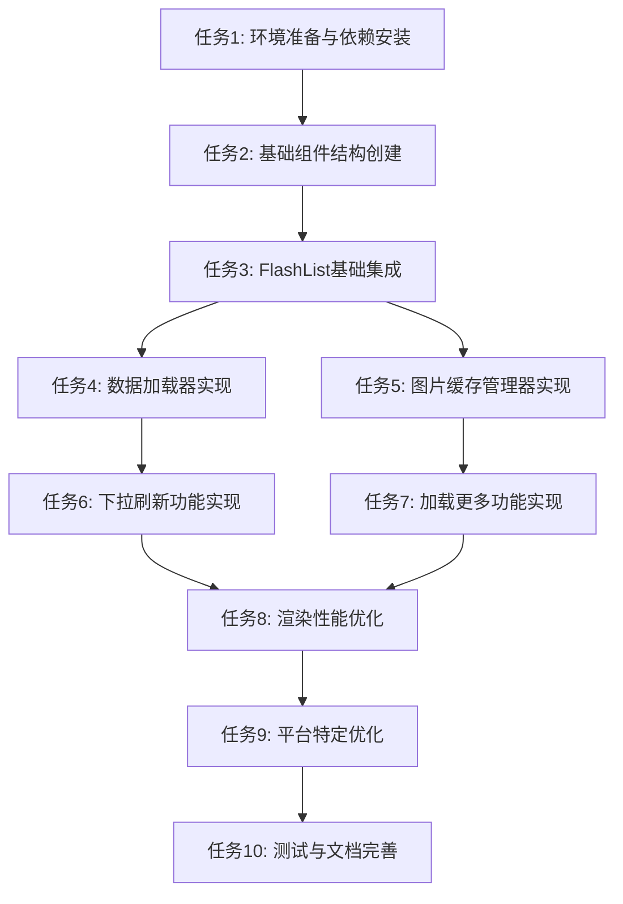

# FlashList双列瀑布流组件实现任务清单

## 任务概述

本文档将FlashList双列瀑布流组件的实现过程拆解为具体的原子化任务，每个任务都有明确的输入、输出和验收标准。

## 任务依赖关系图

## 原子化任务清单

### 任务1: 环境准备与依赖安装

**任务描述**: 安装FlashList及相关依赖，配置开发环境

**输入契约**:
- 前置依赖: 无
- 输入数据: 项目根目录路径
- 环境依赖: Node.js 20+, React Native 0.82.1

**输出契约**:
- 输出数据: 更新后的package.json和metro.config.js
- 交付物: 安装完成的依赖包
- 验收标准: 
  - @shopify/flash-list安装成功
  - Metro配置正确
  - 项目可以正常启动

**实现约束**:
- 技术栈: React Native, TypeScript
- 接口规范: 遵循项目现有代码规范
- 质量要求: 不破坏现有功能

**依赖关系**: 无

---

### 任务2: 基础组件结构创建

**任务描述**: 创建瀑布流组件的基础目录结构和文件

**输入契约**:
- 前置依赖: 任务1完成
- 输入数据: 项目目录结构
- 环境依赖: 已安装的依赖包

**输出契约**:
- 输出数据: 组件目录结构
- 交付物: 
  - components/WaterfallList/index.tsx
  - components/WaterfallList/WaterfallListItem.tsx
  - components/WaterfallList/types.ts
  - components/WaterfallList/styles.ts
- 验收标准: 
  - 所有文件创建成功
  - 文件结构符合设计规范
  - TypeScript类型定义正确

**实现约束**:
- 技术栈: React Native, TypeScript
- 接口规范: 遵循项目现有代码规范
- 质量要求: 代码结构清晰，易于维护

**依赖关系**: 任务1

---

### 任务3: FlashList基础集成

**任务描述**: 实现基础的FlashList双列布局

**输入契约**:
- 前置依赖: 任务2完成
- 输入数据: 基础组件文件
- 环境依赖: FlashList库

**输出契约**:
- 输出数据: 实现基础功能的WaterfallList组件
- 交付物: 
  - 基础双列布局实现
  - 基本样式定义
  - 简单的渲染项组件
- 验收标准: 
  - 可以显示双列布局
  - 基本样式正确
  - 可以渲染静态数据

**实现约束**:
- 技术栈: React Native, FlashList
- 接口规范: 遵循FlashList API规范
- 质量要求: 代码简洁，性能良好

**依赖关系**: 任务2

---

### 任务4: 数据加载器实现

**任务描述**: 实现数据加载、分页和状态管理

**输入契约**:
- 前置依赖: 任务3完成
- 输入数据: 基础WaterfallList组件
- 环境依赖: 无额外依赖

**输出契约**:
- 输出数据: 实现数据加载功能的DataLoader类
- 交付物: 
  - utils/DataLoader.ts
  - 数据加载逻辑
  - 分页处理逻辑
  - 错误处理机制
- 验收标准: 
  - 可以正确加载初始数据
  - 支持分页加载
  - 错误处理机制工作正常

**实现约束**:
- 技术栈: TypeScript, React Native
- 接口规范: 遵循设计文档中的接口定义
- 质量要求: 代码健壮，错误处理完善

**依赖关系**: 任务3

---

### 任务5: 图片缓存管理器实现

**任务描述**: 实现图片缓存和预加载功能

**输入契约**:
- 前置依赖: 任务3完成
- 输入数据: 基础WaterfallList组件
- 环境依赖: React Native Image组件

**输出契约**:
- 输出数据: 实现图片缓存功能的ImageCacheManager类
- 交付物: 
  - utils/ImageCacheManager.ts
  - 图片缓存逻辑
  - 图片预加载逻辑
  - 缓存清理机制
- 验收标准: 
  - 图片可以正确缓存
  - 预加载功能正常
  - 缓存大小可控

**实现约束**:
- 技术栈: TypeScript, React Native
- 接口规范: 遵循设计文档中的接口定义
- 质量要求: 内存使用合理，性能良好

**依赖关系**: 任务3

---

### 任务6: 下拉刷新功能实现

**任务描述**: 实现下拉刷新数据功能

**输入契约**:
- 前置依赖: 任务4完成
- 输入数据: 实现数据加载的WaterfallList组件
- 环境依赖: React Native RefreshControl

**输出契约**:
- 输出数据: 实现下拉刷新功能的WaterfallList组件
- 交付物: 
  - 下拉刷新逻辑
  - 刷新状态管理
  - 刷新UI反馈
- 验收标准: 
  - 下拉刷新触发正常
  - 刷新状态显示正确
  - 数据刷新成功

**实现约束**:
- 技术栈: React Native, TypeScript
- 接口规范: 遵循React Native RefreshControl API
- 质量要求: 用户体验流畅，状态管理正确

**依赖关系**: 任务4

---

### 任务7: 加载更多功能实现

**任务描述**: 实现滚动到底部加载更多数据功能

**输入契约**:
- 前置依赖: 任务4、任务5完成
- 输入数据: 实现数据加载和图片缓存的WaterfallList组件
- 环境依赖: FlashList onEndReached API

**输出契约**:
- 输出数据: 实现加载更多功能的WaterfallList组件
- 交付物: 
  - 加载更多逻辑
  - 加载状态管理
  - 加载UI反馈
- 验收标准: 
  - 滚动到底部触发加载
  - 加载状态显示正确
  - 数据加载成功
  - 防止重复加载

**实现约束**:
- 技术栈: React Native, FlashList, TypeScript
- 接口规范: 遵循FlashList onEndReached API
- 质量要求: 用户体验流畅，状态管理正确

**依赖关系**: 任务4, 任务5

---

### 任务8: 渲染性能优化

**任务描述**: 优化列表渲染性能，提升用户体验

**输入契约**:
- 前置依赖: 任务6、任务7完成
- 输入数据: 实现完整功能的WaterfallList组件
- 环境依赖: React Native性能分析工具

**输出契约**:
- 输出数据: 性能优化后的WaterfallList组件
- 交付物: 
  - 渲染优化代码
  - 内存优化代码
  - 性能测试报告
- 验收标准: 
  - 滚动流畅度提升
  - 内存使用优化
  - 大数据量场景下性能稳定

**实现约束**:
- 技术栈: React Native, FlashList, TypeScript
- 接口规范: 遵循React Native性能最佳实践
- 质量要求: 性能指标达到设计要求

**依赖关系**: 任务6, 任务7

---

### 任务9: 平台特定优化

**任务描述**: 针对Android和iOS平台进行特定优化

**输入契约**:
- 前置依赖: 任务8完成
- 输入数据: 性能优化后的WaterfallList组件
- 环境依赖: Android Studio, Xcode

**输出契约**:
- 输出数据: 平台优化后的WaterfallList组件
- 交付物: 
  - Android平台优化代码
  - iOS平台优化代码
  - 平台差异处理代码
- 验收标准: 
  - Android平台运行流畅
  - iOS平台运行流畅
  - 平台UI表现一致

**实现约束**:
- 技术栈: React Native, Android, iOS
- 接口规范: 遵循各平台UI/UX规范
- 质量要求: 平台体验符合用户预期

**依赖关系**: 任务8

---

### 任务10: 测试与文档完善

**任务描述**: 编写测试用例和完善组件文档

**输入契约**:
- 前置依赖: 任务9完成
- 输入数据: 平台优化后的WaterfallList组件
- 环境依赖: Jest, React Native Testing Library

**输出契约**:
- 输出数据: 完整的测试用例和文档
- 交付物: 
  - 单元测试代码
  - 集成测试代码
  - 组件使用文档
  - API文档
- 验收标准: 
  - 测试覆盖率达到80%以上
  - 所有测试用例通过
  - 文档完整清晰

**实现约束**:
- 技术栈: Jest, React Native Testing Library, TypeScript
- 接口规范: 遵循测试驱动开发规范
- 质量要求: 测试全面，文档详尽

**依赖关系**: 任务9

## 任务执行计划

### 第一周
- 第1-2天: 任务1、任务2
- 第3-4天: 任务3、任务4
- 第5天: 任务5

### 第二周
- 第1-2天: 任务6、任务7
- 第3-4天: 任务8
- 第5天: 任务9

### 第三周
- 第1-2天: 任务10
- 第3-5天: 集成测试和问题修复

## 风险评估与应对策略

### 高风险任务
1. **任务8: 渲染性能优化** - 可能遇到性能瓶颈
   - 应对策略: 提前进行性能测试，准备备选方案

2. **任务9: 平台特定优化** - 可能遇到平台兼容性问题
   - 应对策略: 优先在主流设备上测试，准备平台特定代码

### 中风险任务
1. **任务5: 图片缓存管理器实现** - 可能遇到内存管理问题
   - 应对策略: 限制缓存大小，实现缓存清理机制

2. **任务7: 加载更多功能实现** - 可能遇到状态管理问题
   - 应对策略: 使用状态管理库，简化状态逻辑

## 质量保证措施

1. **代码审查**: 每个任务完成后进行代码审查
2. **单元测试**: 对核心功能编写单元测试
3. **集成测试**: 定期进行集成测试，确保组件协同工作
4. **性能测试**: 定期进行性能测试，监控性能指标
5. **用户测试**: 在真实设备上进行用户体验测试

## 总结

本任务清单将FlashList双列瀑布流组件的实现过程拆解为10个原子化任务，每个任务都有明确的输入、输出和验收标准。通过按照任务依赖关系和执行计划逐步实施，可以确保项目按时高质量完成。同时，通过风险评估和质量保证措施，可以降低项目风险，提高项目成功率。